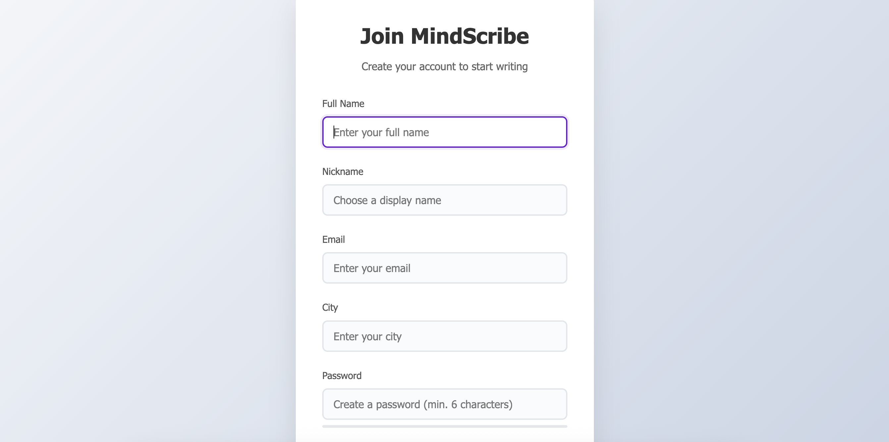

# BlogWebsite
A simple blog website built using HTML, CSS, JavaScript, and Firebase.

## Features

* **Splash Screen**: A visually appealing splash screen to welcome users.
* **User Authentication**: Login and Signup functionality using Firebase Authentication.
* **Dashboard**: A personalized dashboard for users to manage their blogs.
* **Add Blog**: Users can create and publish new blog posts.
* **View and Draft**: Users can view their published blogs and save drafts for later.
* **Profile Section**: Users can view and edit their profile information.
* **Forgot Password**: Users can reset their password using Firebase's password reset feature.

## Technologies Used

* **Frontend**: HTML, CSS, JavaScript
* **Backend**: Firebase (Firebase Authentication, Firebase Realtime Database or Firestore)

## Screenshots

### Splash Screen

### Login

### Signup

### Dashboard

### Add Blog

### View and Draft

### Profile Section

### Forgot Password

## Getting Started

1. Clone the repository: `git clone https://github.com/MAHEKKEVAT/BlogWebsite.git`
2. Open the project in your favorite code editor.
3. Set up Firebase in your project by creating a new Firebase project and enabling Firebase Authentication and Realtime Database or Firestore.
4. Update the Firebase configuration in your code.

## Contributing

Contributions are welcome! If you'd like to contribute to this project, please fork the repository and submit a pull request.

## License

This project is licensed under the MIT License. See the LICENSE file for details.
